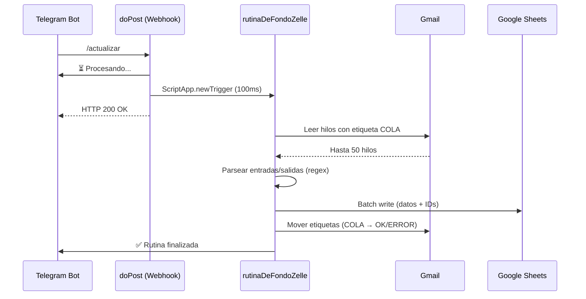

# Payment Consolidation

**Sistema de Relación de Pagos** — Conciliación automatizada de transacciones Zelle mediante Google Apps Script.

## Arquitectura

```
Gmail (etiquetas)  →  Apps Script (procesador)  →  Google Sheets (persistencia)
                                                 →  Telegram Bot (notificaciones)
```

### Módulos

| Archivo | Responsabilidad |
|---|---|
| `Code.js` | Entry point. Webhook `doPost` para Telegram |
| `Zelle_Processor.js` | Lógica de conciliación, regex, batch write |
| `Telegram_Module.js` | `enviarMensajeTelegram`, registro de webhook, botón de pánico |
| `Background_Runner.js` | Trigger asíncrono para desacoplar webhook de procesamiento |

## Flujo de Procesamiento



## Requisitos

### Script Properties

Configurar en: [Editor de Apps Script](https://script.google.com/home/projects/1cY1iVSzd3pV9YQ8z0SwEBkL858GV5CGh_b5AHvimqCSMmlDL-m7p5nIY/settings)

| Propiedad | Descripción | Ejemplo |
|---|---|---|
| `TELEGRAM_TOKEN` | Token del bot de Telegram | `123456:ABC-DEF...` |
| `TELEGRAM_CHAT_ID` | Chat ID del usuario/grupo | `123456789` |
| `SPREADSHEET_ID` | ID del Google Sheet destino | `1gjKfRt8iPnzsH0O11AfjWI8WXqSYxgJDyKI2EzG3V2I` |
| `SHEET_NAME` | Nombre de la hoja | `Transacciones` |
| `LABEL_COLA` | Etiqueta Gmail de correos pendientes | `Zelle/Cola` |
| `LABEL_OK` | Etiqueta Gmail de correos procesados | `Zelle/Registrado` |
| `LABEL_ERROR` | Etiqueta Gmail de correos con error | `Zelle/Error` |
| `WEB_APP_URL` | URL del Web App desplegado | `https://script.google.com/macros/s/.../exec` |

### Estructura del Sheet

| Col A | Col B | Col C | Col D | Col E | Col F | Col G | Col H |
|---|---|---|---|---|---|---|---|
| Fecha | Tipo | Remitente/Destinatario | (vacío) | Entrada $ | Salida $ | (vacío) | Message ID |

## Despliegue

```bash
# Instalar dependencias
npm install

# Deploy automático (zero-touch)
npm run deploy:dev:auto

# Deploy interactivo
npm run deploy:dev
```

## Setup Inicial (una vez)

1. Desplegar el proyecto con `npm run deploy:dev:auto`
2. En Apps Script, ir a **Implementar > Nueva implementación > Aplicación web**
3. Copiar la URL del Web App
4. Configurar todas las Script Properties (ver tabla arriba)
5. Ejecutar `registrarWebhookTelegram()` desde el editor de Apps Script
6. Enviar `/actualizar` al bot de Telegram para verificar

## Emergencias

Ejecutar `botonDePanicoYLimpieza()` desde el editor de Apps Script para:
- Eliminar el webhook de Telegram
- Vaciar la cola de mensajes pendientes
